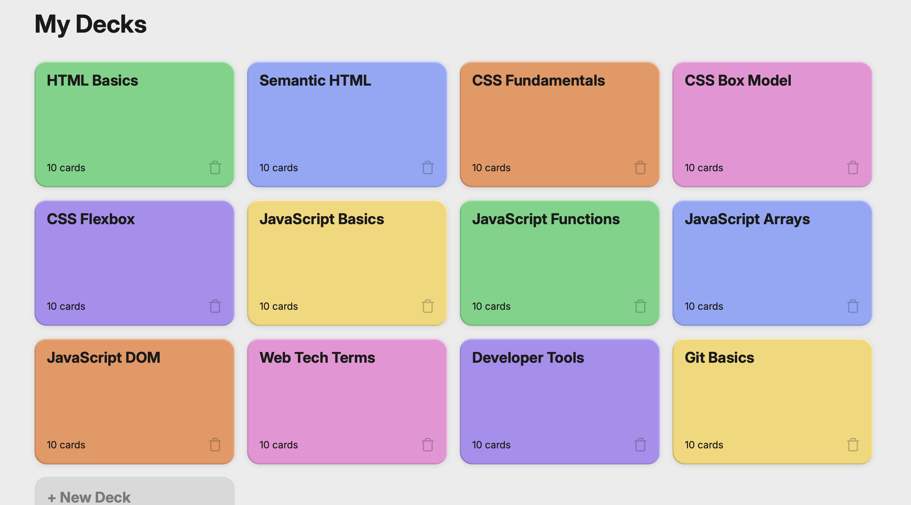
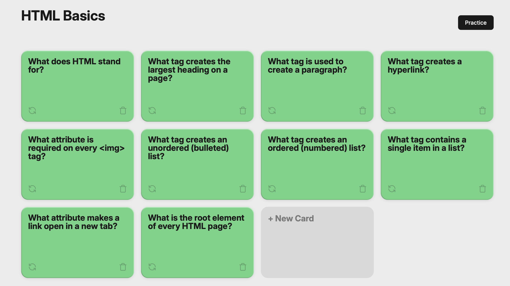
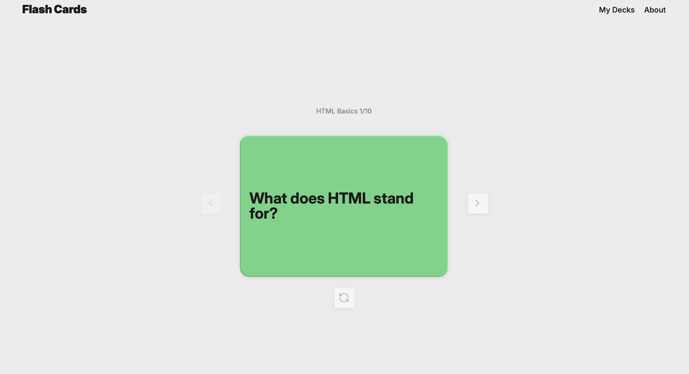
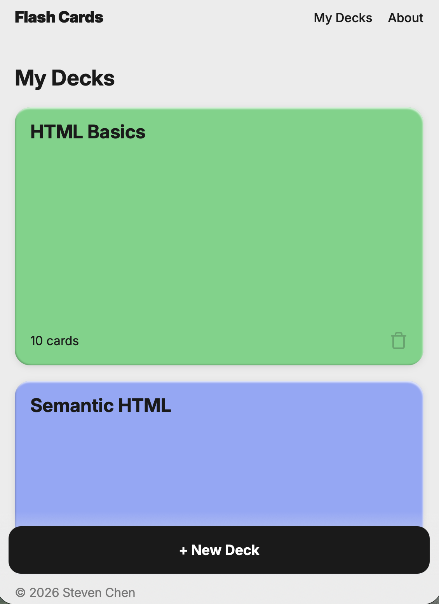
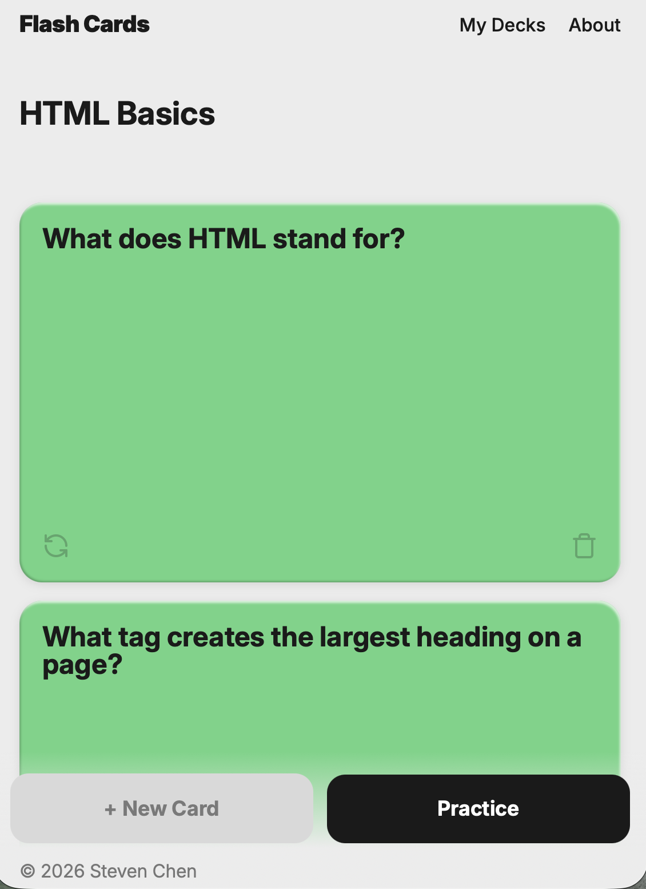
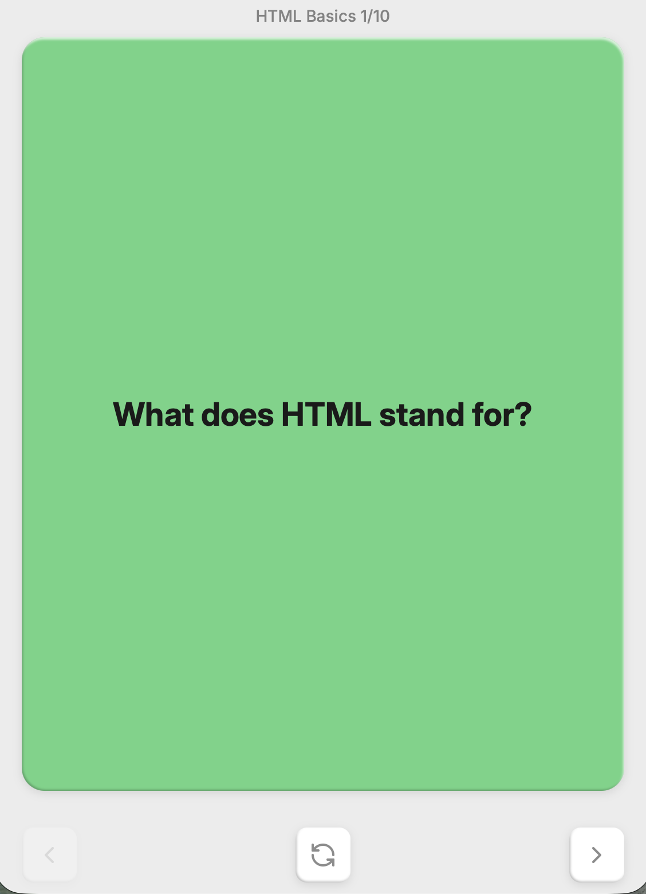
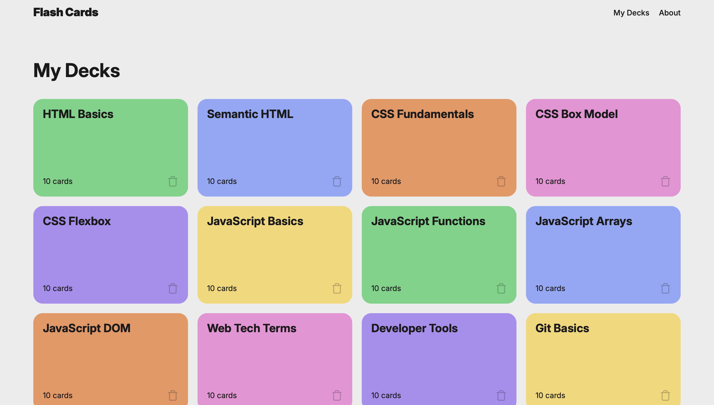

# Flashcard app

## Description

#### This website provides a useful tool to create/delete study decks. It provides the flexibililty of being able to add/remove topics and/or questions. You first begin by selecting one of the flashcard topics. It will take you to a gallery view of all the questions in that deck where you can add/remove questions. Clicking the practice button will move you to carousel view where you can rotate through the questions and flip the card for the answer.

Check out [this project](https://sc429.github.io/ai-se_project_flashcards/)

## Feature

#### This app provides multiple features of creating your own deck and adding content to help you study.

1. Home View:

- The study decks are displayed in a grid view. Each study deck card contains its title along with a card count and a deletion button. This allows a transparent view of the number of flashcards are in each deck. The deletion button also allows for flexibility for the user to adjust the decks as he/she so choooses.

2. Open Deck View:

- Deck information: 
Each card will have the its question presented along with a flip button and deletion button. All the cards in the deck will have the same color as the deck color.

- Card Display:
When a user clicks on a study deck, they will be taken to the open deck view where all the flashcards of the deck are displayed in a grid view. The question will be displayed by default on each card. This allows for easy management of the content of the deck.

- Interactive Elements:
The flip button on each card will "flip" the card to the answer along with the background color turning white. The delete button on each card will delete it from the deck. The "New Card" button will add a new card into the deck. The practice button will open the carousel view of the deck allowing you to rotate through the cards one by one.

3. Carousel View:

- Provides a study-like view where the cards in the deck are displayed one at a time. It allows you to rotate through the cards individually to simulate a study environment. The view contains the card with the previous, flip, and next buttons to allow for a dynamic view of each card.

4. Responsive Design

- Laptop View:
When viewing on a larger screen like a monitor or laptop, the decks and cards are displayed in a grid-like structure. The "+ New Deck" and "New Card" buttons falls in-line with the decks. In the carousel view, the previous, flip and next button are positioned on the left, bottom and right side of the card, respectively.

- Mobile View:
On a smaller screen like a phone, the decks and cards are displayed in a stack view where the width of the cards are the width of the screen. The "+ New Deck" and "New Card" buttons become static on the bottom of the screen allowing for easy access. The footer also becomes fixed on the bottom of the screen. In the carousel view, the previous, flip and next buttons moved to the bottom of the card.

## Technologies used

#### The app mainly uses a combination of HTML and CSS for frontend and Javascript for backend. The specific topics are using media queries to create dynamic views for different screen views and CSS grid layouts to position the cards/decks.

